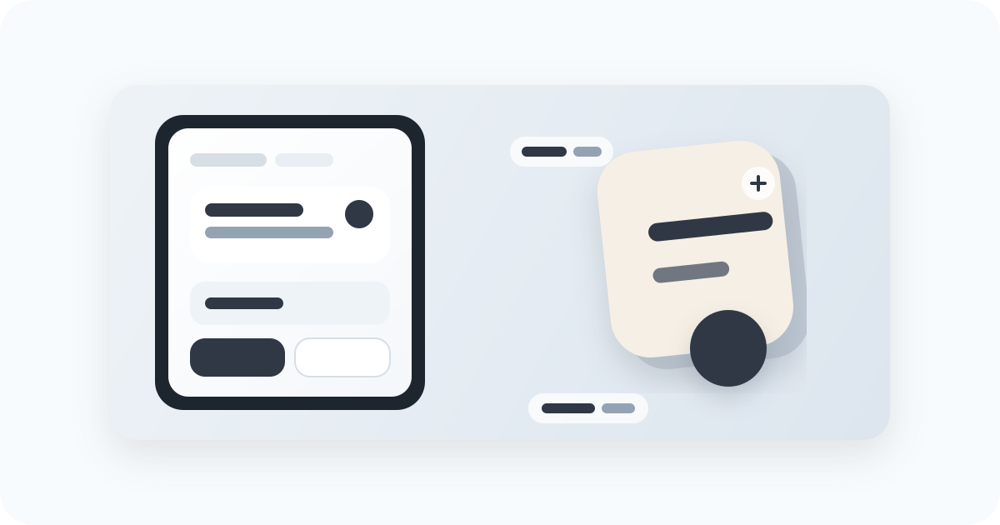

# 幕钉

一个面向 Android 的悬浮截图与贴图工具。

幕钉把截图、贴图、OCR 和轻量编辑压进一条更短的操作链路里，减少在相册、编辑器和分享面板之间来回切换。



## 隐私说明

幕钉默认在本机处理截图、贴图、OCR 文本和历史记录，不会自动上传这些内容。

- 截图、贴图、OCR 结果和历史记录保存在本机。
- 图片 OCR 使用本地识别能力；本地翻译在设备上执行，但可能需要下载对应语言模型。
- 只有你主动配置并使用云翻译时，待翻译文本才会发送到所选翻译服务商。

## 这是什么

幕钉的核心思路不是“多一个截图 App”，而是把屏幕上的内容更快地变成可继续操作的材料。

你可以把它理解成：

- 点一下悬浮球，快速截图
- 结果直接贴到屏幕上，而不是先落进相册
- 需要时再 OCR、编辑、恢复历史贴图或继续处理

## 主要功能

- 悬浮球截图
- 截图后直接贴图，或进入编辑器
- 相册贴图
- 图片 OCR
- OCR 后翻译，可使用本地模型或可选云翻译
- 剪贴板文字贴图
- 编辑后再次贴图
- 贴图历史与恢复
- 悬浮球外观自定义

## 适合什么场景

- 临时摘录屏幕内容并保留在桌面上对照
- 从相册或截图里提取文字，再继续整理
- 做轻量标注后直接贴回工作流
- 在多个应用之间搬运信息，而不想频繁切回相册

## 快速上手

第一次使用时，通常只需要把这几步走通：

1. 安装并启动应用
2. 打开悬浮窗权限
3. 按提示授权截图能力
4. 刷新悬浮球
5. 点击悬浮球截图，或长按打开更多入口

如果希望减少每次截图前的系统授权确认，熟悉 Android 权限管理的用户可以自行通过 Shizuku + App Ops 等工具授予相关能力。该项目不提供此类配置教程，也不建议不了解风险的用户尝试。

## 权限说明

幕钉依赖以下 Android 能力：

- 悬浮窗权限：用于显示悬浮球和贴图
- MediaProjection 授权：用于截图和 OCR
- 前台服务通知权限：用于后台截图服务
- 相册读写相关权限：用于导入图片和导出结果

如果第一次体验不完整，通常不是应用没启动，而是权限还没有给全。

## 当前状态

这个项目目前仍在持续迭代中，重点在：

- 截图链路流畅度
- 贴图交互体验
- 悬浮球外观和默认配置
- OCR 与翻译配置整理

如果你准备实际使用，建议优先在真机上验证自己的常用流程。

## 许可

本项目采用 GPL-3.0-only 许可。你可以使用、复制、修改和分发；如果分发修改版或基于本项目的版本，需要同样以 GPL-3.0-only 开源并提供源代码。

详情见 [LICENSE](LICENSE)。

## 本地构建

环境要求：

- Android SDK 34
- Min SDK 26
- Java 17
- Gradle 8.7

构建 Debug 包：

```powershell
./gradlew.bat assembleDebug
```

运行单元测试：

```powershell
./gradlew.bat testDebugUnitTest
```
